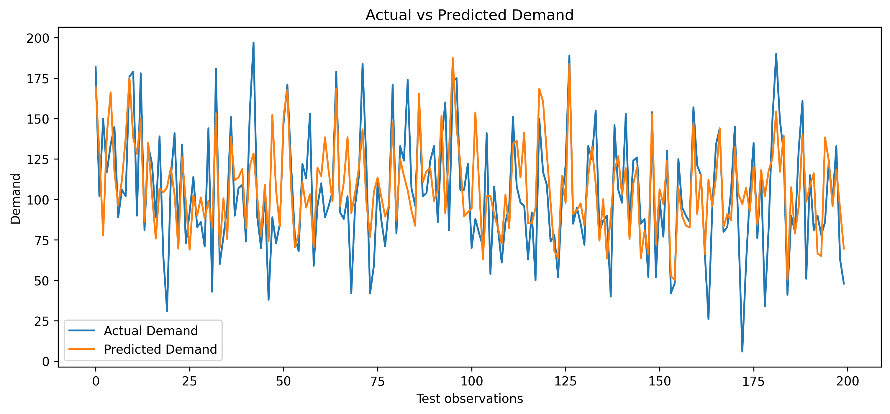
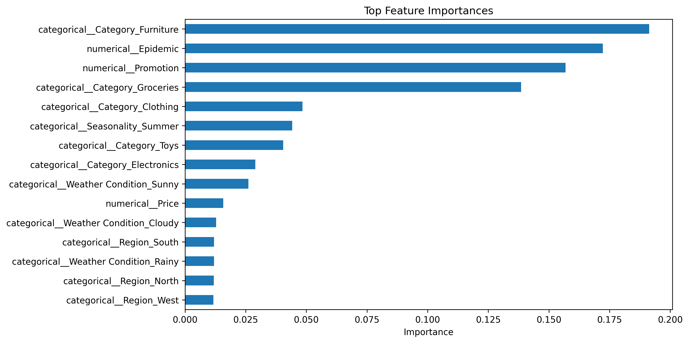

#  Demand Forecasting with Machine Learning

##  Project Overview

This project focuses on **demand forecasting using Machine Learning** based on historical sales data and contextual information.

The objective is to build a regression model capable of predicting product demand using factors such as price, discounts, inventory level, promotions, competitor pricing, region, weather conditions, seasonality, and date-related features.

The project covers the complete Data Science workflow, from data preprocessing and feature engineering to model training, evaluation, and deployment.

---

##  Objectives

* Analyze historical demand data.
* Perform data preprocessing and feature engineering.
* Transform categorical variables using **One-Hot Encoding**.
* Build a Machine Learning pipeline.
* Train an **XGBoost regression model**.
* Optimize the model using **RandomizedSearchCV** and **TimeSeriesSplit**.
* Evaluate the model using MAE, RMSE, and R².
* Analyze feature importance.
* Deploy the trained model using **Streamlit**.

---

##  Target Variable

The target variable is:

```text
Demand
```

The model predicts the expected demand for a given product and context.

---

## Features

The model uses the following features:

### Numerical Features

* Price
* Discount
* Inventory Level
* Promotion
* Competitor Pricing
* Epidemic
* Year
* Month
* Day
* Weekday

### Categorical Features

* Category
* Region
* Weather Condition
* Seasonality

---

##  Feature Engineering

The original `Date` variable is transformed into several time-related features:

* **Year**
* **Month**
* **Day**
* **Weekday**

These features allow the model to capture temporal patterns in demand.

---

##  Data Preprocessing

The preprocessing pipeline includes:

### Categorical Variables

Categorical variables are transformed using **One-Hot Encoding**.

```text
Category
   ↓
OneHotEncoder
   ↓
Numerical feature vectors
```

The encoder uses:

```python
OneHotEncoder(handle_unknown="ignore")
```

This allows the model to handle categories that may appear in new data during prediction.

### Numerical Variables

Numerical variables are passed directly to the model.

The preprocessing and model are combined into a single **Scikit-learn Pipeline**.

---

##  Train / Test Strategy

Because this is a **time-dependent forecasting problem**, the dataset is split chronologically rather than randomly.

The first **80%** of the observations are used for training, while the remaining **20%** are used for testing.

This approach helps preserve the temporal structure of the data and avoids using future observations to train the model.

---

##  Machine Learning Model

The main model used in this project is:

### XGBoost Regressor

```text
XGBRegressor
```

XGBoost was selected because it is a powerful gradient boosting algorithm suitable for regression problems and capable of modeling complex relationships between features and demand.

The model is combined with the preprocessing step inside a single pipeline.

---

##  Hyperparameter Optimization

Model hyperparameters were optimized using:

* **RandomizedSearchCV**
* **TimeSeriesSplit**
* 3 time-series cross-validation splits
* 25 randomly sampled parameter combinations

The optimization considers parameters such as:

* `n_estimators`
* `max_depth`
* `learning_rate`
* `subsample`
* `colsample_bytree`
* `min_child_weight`

The optimization metric is **Mean Absolute Error (MAE)**.

---

##  Model Performance

The final model was evaluated on the test set using three regression metrics.

| Metric   |      Score |
| -------- | ---------: |
| **MAE**  |  **27.01** |
| **RMSE** |  **26.84** |
| **R²**   | **0.6292** |

### Metrics

**MAE — Mean Absolute Error**

Measures the average absolute difference between actual and predicted demand.

**RMSE — Root Mean Squared Error**

Measures prediction error while giving more weight to larger errors.

**R² — R-squared**

Measures the proportion of the variance in demand explained by the model.

---

##  Model Visualizations

### 1. Actual vs Predicted Demand

This visualization compares the actual demand values with the demand predicted by the XGBoost model on the test set.



** Image location:**

```text
images/actual_vs_predicted.png
```

---

### 2. Top Feature Importances

This visualization shows the **15 most important features** according to the trained XGBoost model.



** Image location:**

```text
images/feature_importance.png
```

> Feature importance represents the contribution of features to the model's predictions based on the model's internal importance measure. It should not be interpreted as causal impact.

---

##  Project Workflow

```text
Raw Data
   │
   ▼
Data Exploration
   │
   ▼
Data Preprocessing
   │
   ├── Numerical Features
   │
   └── Categorical Features
          │
          ▼
    One-Hot Encoding
          │
          ▼
Feature Engineering
   │
   ▼
Chronological Train/Test Split
   │
   ▼
XGBoost Regression
   │
   ▼
Hyperparameter Optimization
   │
   ▼
Model Evaluation
   │
   ├── MAE
   ├── RMSE
   └── R²
   │
   ▼
Feature Importance Analysis
   │
   ▼
Model Deployment
   │
   ▼
Streamlit Application
```

---

##  Deployment

The trained preprocessing + XGBoost pipeline is saved as:

```text
xgboost_demand_pipeline.pkl
```

The Streamlit application uses this pipeline to generate demand predictions from user-provided inputs.

To launch the application:

```bash
streamlit run app.py
```

The application allows the user to provide features such as:

* Price
* Discount
* Inventory Level
* Promotion
* Competitor Price
* Category
* Region
* Weather Condition
* Seasonality
* Epidemic
* Date

The model then returns the predicted demand.

---

##  Project Structure

```text
Demand-Forecasting-Project/
│
├── images/
│   ├── actual_vs_predicted.png
│   └── feature_importance.png
│
├── analysis.ipynb
├── machine_learning.ipynb
├── app.py
├── requirements.txt
├── xgboost_demand_pipeline.pkl
├── .gitignore
└── README.md
```

---

##  Technologies

* Python
* Pandas
* NumPy
* Matplotlib
* Scikit-learn
* XGBoost
* Jupyter Notebook
* Streamlit
* Git
* GitHub

---

##  Future Improvements

Possible improvements include:

* Testing additional forecasting models.
* Comparing XGBoost with other regression algorithms.
* Performing more extensive hyperparameter optimization.
* Adding additional temporal features.
* Incorporating lag and rolling-window features.
* Improving the Streamlit interface.
* Monitoring model performance after deployment.
* Exploring more advanced time-series forecasting techniques.

---

##  Author

**Maryem Ben Cheikh**

Software Engineering Student at INSAT
Interested in **Data Science, Machine Learning and Data Analytics**.

---

##  Project Focus

This project demonstrates an end-to-end **Data Science and Machine Learning workflow** for demand forecasting, including:

**Data Analysis → Feature Engineering → Machine Learning → Model Evaluation → Visualization → Deployment**
